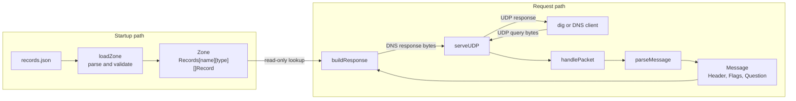

# DNS Server Architecture

## Purpose

This project is a small DNS server written in Go to learn DNS wire-format parsing, UDP networking, and DNS response construction.

It is not a recursive resolver. It listens locally on `127.0.0.1:8053`, parses one DNS question, and returns configured IPv4 answers for `A` queries in the `IN` class. Missing names inside the configured zone return `NXDOMAIN`, names outside the zone return `REFUSED`, and unsupported types on existing names receive a valid response with no answer records.

## Architecture Diagram



The configuration file is read once before the UDP socket is opened. The validated runtime zone is then reused for every query.

For example, run the server in one terminal:

```bash
go run .
```

Then send an A query from another terminal:

```bash
dig +noedns @127.0.0.1 -p 8053 example.com A
```

The server receives the query, parses `example.com`, builds an answer for `1.2.3.4`, and sends the response back to `dig`.

## Runtime Flow

### 1. Load configured records

`main.go` calls `loadZone` with `records.json`. The loader decodes the JSON, canonicalizes the origin and record names, validates each IPv4 address, rejects duplicate names and out-of-zone records, and creates the runtime `Zone`.

If the file cannot be read or validated, the program exits before opening the UDP socket.

### 2. Receive a UDP packet

`main.go` creates a UDP listener on `127.0.0.1:8053` and passes it to `serveUDP`. The server loop allocates a 512-byte buffer, then waits for packets with `ReadFromUDP`.

`ReadFromUDP` returns the number of bytes received and the sender address. The program slices the buffer to the exact packet length before parsing it:

```go
packet := buf[:n]
```

This prevents unused bytes from the fixed buffer from becoming part of the DNS message.

### 3. Parse the DNS query

`parseMessage` in `dns.go` converts the packet bytes into a `Message` struct. It expects exactly one question and does this work in order:

1. `parseHeader` reads the fixed 12-byte DNS header.
2. `parseFlags` extracts individual bits such as `QR`, `RD`, and `RA` from the header flags.
3. `parseQuestion` starts at byte offset 12, parses the QNAME, then reads QTYPE and QCLASS.

`parseQName` reads DNS labels such as `03 www 07 example 03 com 00` and joins them into `www.example.com`. It returns the offset immediately after the terminating `00`; `parseQuestion` uses that offset to locate the two-byte QTYPE and QCLASS fields.

The parser returns errors for truncated or malformed packets. `handlePacket` returns the error to `serveUDP`, which logs it and continues waiting for the next UDP packet instead of terminating the server.

### 4. Build a DNS response

After a query is successfully parsed, `handlePacket` calls `buildResponse` in `response.go`.

`buildResponse` receives the parsed `Message` and `Zone` from `main.go`. Each `Record` contains a TTL and wire-ready RDATA. The builder classifies the query against the zone, encodes a new question section, and constructs the DNS response from the parsed fields and selected record:

- Copies the transaction ID from the query so `dig` can match the reply to its request.
- Sets `QR = 1` to mark the packet as a response.
- Copies `RD` from the query.
- Leaves `RA = 0` because this server does not provide recursive resolution.
- Sets `QDCOUNT = 1` and copies the original question into the response.
- Sets `ANCOUNT = 1` only when the queried name has a configured `A / IN` record; otherwise it sets `ANCOUNT = 0`.
- Sets `RCODE = NXDOMAIN` when the queried name is missing inside the zone.
- Sets `RCODE = REFUSED` when the queried name is outside the zone.

For the configured `example.com A / IN` query, the answer section contains:

```text
NAME     0xc00c  (pointer to the original QNAME at byte 12)
TYPE     1       (A)
CLASS    1       (IN)
TTL      60
RDLENGTH 4
RDATA    1.2.3.4
```

The `0xc00c` name uses DNS compression in the response. It points back to the encoded QNAME at byte 12 instead of encoding the domain name again in the answer.

### 5. Send the response

`serveUDP` sends the bytes returned by `handlePacket` to the original sender address with `WriteToUDP`. `dig` receives the response and displays either:

- The configured `A` answer for a known name.
- `NXDOMAIN` for a missing name inside the zone.
- `REFUSED` for a name outside the zone.
- A valid DNS response with `ANSWER: 0` for unsupported types on known names, such as `example.com AAAA`.

## File Responsibilities

| File | Responsibility |
| --- | --- |
| `main.go` | Loads configured records, opens the UDP socket, and starts the server loop. |
| `config.go` | Reads and validates JSON configuration, then converts it into a runtime zone. |
| `config_test.go` | Tests origin and record validation, canonicalization, malformed input, invalid addresses, duplicates, and out-of-zone records. |
| `records.json` | Defines the zone origin and A records loaded when the server starts. |
| `record.go` | Defines the generic runtime record containing TTL and wire-ready RDATA. |
| `zone.go` | Groups the origin and records by owner name and DNS type, and classifies names as in-zone or out-of-zone. |
| `zone_test.go` | Tests zone-boundary matching and owner-name existence. |
| `server.go` | Receives and sends UDP packets, coordinates parsing and response building, and logs query results. |
| `server_test.go` | Sends real queries over a loopback UDP socket and verifies the returned responses. |
| `dns.go` | Parses DNS headers, flags, QNAMEs, questions, and one complete DNS message. |
| `response.go` | Encodes a DNS response from a parsed message and explicitly supplied records, including the question and optional A answer. |
| `dns_test.go` | Tests parser behavior and malformed DNS query handling. |
| `response_test.go` | Tests response flags, answer counts, answer bytes, and unsupported query behavior. |
| `README.md` | Provides setup instructions, `dig` demos, DNS wire-format background, and limitations. |

## Current Behavior

| Query | Result |
| --- | --- |
| `example.com A / IN` | Returns `1.2.3.4` with TTL 60. |
| `test.example.com A / IN` | Returns `5.6.7.8` with TTL 300. |
| Missing name inside `example.com` | Returns `NXDOMAIN` with no answers. |
| Name outside `example.com` | Returns `REFUSED` with no answers. |
| Unsupported type on a configured name | Returns `NOERROR` with no answers. |
| Unsupported class | Returns a valid response with no answers. |
| Malformed packet | Logs a parse or response-building error and keeps the UDP server running. |

The current response is selected by zone membership, owner-name existence, QTYPE, and QCLASS. The answer RDATA and TTL come from the selected `Record`.

## Design Decisions

- The parser is separate from UDP networking so DNS byte handling can be tested without starting a server.
- The response builder is separate from `main.go` so response bytes can be tested directly.
- Packet handling is separate from the UDP loop so parsing and response construction have a single testable boundary.
- Each packet is parsed into a `Message` once, and that parsed message is passed to the response builder.
- The response builder depends on parsed data rather than the original query bytes.
- The zone is passed explicitly to the response builder instead of being read as global state.
- Runtime records use `Records[name][type][]Record`, allowing multiple types and multiple records per owner without changing the zone shape.
- Configuration parsing converts human-readable values into validated, wire-ready RDATA once during startup.
- Zone membership requires either the exact origin or a label-delimited subdomain, so `badexample.com` is not inside `example.com`.
- Configuration is validated and converted into runtime records once during startup rather than parsed for each query.
- The server accepts one question per message to keep the first implementation understandable.
- The server reports `RA = 0` because it does not recursively resolve or forward queries.
- The response uses compression only when writing the answer. Incoming compressed QNAMEs are not supported yet.

## Current Limitations

- One question per message only.
- No compressed QNAMEs in incoming queries.
- No EDNS support; use `+noedns` with `dig` for the documented demo.
- UDP only; no TCP DNS fallback.
- No recursive resolution, upstream forwarding, or caching.
- Configuration changes require restarting the server; live reload is not supported.
- One configured zone only.
- The JSON loader and response builder currently support A records only, even though the runtime store can represent additional types.

## Verification

Run the unit tests:

```bash
go test -count=1 ./...
```

The test suite starts the server on an operating-system-assigned loopback UDP port and verifies configured, missing in-zone, and out-of-zone responses through a real socket. You can also run the server and use the `dig` commands in `README.md` for a manual demo.
