# DNS Server Architecture

## Purpose

This project is a small DNS server written in Go to learn DNS wire-format parsing, UDP and TCP networking, and DNS response construction.

It is not a recursive resolver. It listens locally on `127.0.0.1:8053`, parses one DNS question, and serves authoritative A, AAAA, and SOA data for one configured zone. Negative in-zone responses include the zone SOA, while names outside the zone return `REFUSED`.

## Architecture Diagram

```mermaid
flowchart LR
    subgraph Startup["Startup path"]
        JSON["records.json"]
        Loader["loadZone<br/>parse and validate"]
        ZoneStore["Zone<br/>Records[name][type][]Record"]

        JSON --> Loader
        Loader --> ZoneStore
    end

    subgraph Query["Request path"]
        Client["dig or DNS client"]
        UDP["serveUDP"]
        TCP["serveTCP<br/>length-prefixed framing"]
        Handler["handlePacketWithLimit"]
        Parser["parseMessage"]
        Message["Message<br/>Header, Flags, Question"]
        Planner["planResponse<br/>select sections and RCODE"]
        Plan["responsePlan<br/>answers and authorities"]
        Builder["buildResponse<br/>header and question"]
        Encoder["appendResourceRecord"]

        Client -->|"UDP query bytes"| UDP
        Client -->|"TCP byte stream"| TCP
        UDP --> Handler
        TCP --> Handler
        Handler --> Parser
        Parser --> Message
        Message --> Planner
        Planner --> Plan
        Message --> Builder
        Plan --> Builder
        Builder --> Encoder
        Encoder -->|"DNS response bytes"| UDP
        Encoder -->|"DNS response bytes"| TCP
        UDP -->|"UDP response"| Client
        TCP -->|"length-prefixed TCP response"| Client
    end

    ZoneStore -->|"read-only lookup"| Planner
```



The configuration file is read once before the UDP and TCP listeners are opened. The validated runtime zone is then reused for every query.

For example, run the server in one terminal:

```bash
go run .
```

Then send an A query from another terminal:

```bash
dig +noedns @127.0.0.1 -p 8053 example.com A
```

The server receives the query, parses `example.com`, builds an answer for `1.2.3.4`, and sends the response back to `dig`.

## Runtime Flow

### 1. Load configured records

`main.go` calls `loadZone` with `records.json`. The loader decodes the JSON, canonicalizes the origin, names, and types, validates A and AAAA address families, and encodes the zone SOA. Repeated owner-and-type entries become one RRset. The loader rejects duplicate RDATA, inconsistent TTLs within an RRset, and out-of-zone records before creating the runtime `Zone`.

If the file cannot be read or validated, the program exits before opening either network listener.

### 2. Receive a query over UDP or TCP

`main.go` creates a UDP listener on `127.0.0.1:8053` and passes it to `serveUDP`. The server loop allocates a 512-byte buffer, then waits for packets with `ReadFromUDP`.

`ReadFromUDP` returns the number of bytes received and the sender address. The program slices the buffer to the exact packet length before parsing it:

```go
packet := buf[:n]
```

This prevents unused bytes from the fixed buffer from becoming part of the DNS message.

`main.go` also creates a TCP listener on the same address and passes it to `serveTCP`. Each accepted connection runs in its own goroutine, so one idle client does not block other clients. DNS over TCP is a byte stream, so `readTCPMessage` first reads a two-byte, big-endian message length and then uses `io.ReadFull` to read exactly that many bytes. The connection handler loops, allowing one TCP connection to carry multiple queries.

### 3. Parse the DNS query

`parseMessage` in `dns.go` converts the packet bytes into a `Message` struct. It expects exactly one question and does this work in order:

1. `parseHeader` reads the fixed 12-byte DNS header.
2. `parseFlags` extracts individual bits such as `QR`, `RD`, and `RA` from the header flags.
3. `parseQuestion` starts at byte offset 12, parses the QNAME, then reads QTYPE and QCLASS.

`parseQName` reads DNS labels such as `03 www 07 example 03 com 00` and joins them into `www.example.com`. It returns the offset immediately after the terminating `00`; `parseQuestion` uses that offset to locate the two-byte QTYPE and QCLASS fields.

The parser returns errors for truncated or malformed packets. `handlePacketWithLimit` returns the error to the transport handler. `serveUDP` logs the error and waits for the next datagram. A malformed TCP frame or query closes only that client connection; the TCP listener continues accepting other clients.

### 4. Build a DNS response

After a query is successfully parsed, `handlePacketWithLimit` calls `buildResponseWithLimit` in `response.go`.

`buildResponse` receives the parsed `Message` and `Zone` from `main.go`. Each `Record` contains a TTL and wire-ready RDATA. It asks `planResponse` to classify the query before writing any bytes:

- Every record in a matching A, AAAA, or SOA RRset is placed in the answer section.
- A missing in-zone owner produces `NXDOMAIN` and places the zone SOA in the authority section.
- A known owner with no matching type produces `NOERROR`/NODATA and places the zone SOA in the authority section.
- An out-of-zone name produces `REFUSED` without an authority record.

The builder then constructs the DNS response:

- Copies the transaction ID from the query so `dig` can match the reply to its request.
- Sets `QR = 1` to mark the packet as a response.
- Copies `RD` from the query.
- Leaves `RA = 0` because this server does not provide recursive resolution.
- Sets `AA = 1` for responses concerning names inside the configured zone.
- Sets `QDCOUNT = 1` and copies the original question into the response.
- Sets answer and authority counts from the selected records.

`appendResourceRecord` serializes each selected record using the common resource-record layout:

```text
NAME      compressed pointer or encoded owner name
TYPE      2 bytes
CLASS     2 bytes
TTL       4 bytes
RDLENGTH  2 bytes
RDATA     RDLENGTH bytes
```

Positive answers use `0xc00c`, a pointer to the queried name at byte 12. A negative SOA authority record encodes the zone origin explicitly because its owner can differ from the queried name. SOA names inside RDATA are currently uncompressed, which is valid DNS wire format.

For negative caching, the SOA record in the authority section uses the smaller of its record TTL and SOA MINIMUM value.

The transport supplies the response-size limit. Because EDNS is not supported, UDP uses the classic 512-byte DNS message limit. TCP uses the maximum size represented by its two-byte length prefix, 65,535 bytes. `appendRecordsWithinLimit` encodes each candidate record separately and appends it only when the complete record fits. The builder then patches `ANCOUNT` and `NSCOUNT` with the records actually written.

If required answer or authority data is omitted, the builder sets `TC = 1`. A partial RRset made of complete resource records may remain in a TC-marked response, as described by [RFC 2181, sections 5.1 and 9](https://www.rfc-editor.org/rfc/rfc2181.html). The client is expected to retry using a transport that permits a larger response.

### 5. Send the response

`serveUDP` sends response bytes to the original sender with `WriteToUDP`; UDP responses are at most 512 bytes. `handleTCPConnection` writes a two-byte response length followed by the response bytes. A client that receives a TC-marked UDP response can retry over TCP for the complete response. `dig` displays either:

- A configured A, AAAA, or SOA answer.
- A partial answer with `TC = 1` when required data exceeds the UDP limit.
- `NXDOMAIN` with an SOA authority record for a missing name inside the zone.
- `NOERROR` with an SOA authority record for a missing type on an existing name.
- `REFUSED` for a name outside the zone.

## File Responsibilities

| File | Responsibility |
| --- | --- |
| `main.go` | Loads configured records, opens UDP and TCP listeners on the same port, and runs both server loops. |
| `config.go` | Reads and validates A/AAAA/SOA JSON configuration, forms RRsets, and converts values into wire-ready runtime records. |
| `config_test.go` | Tests SOA encoding, RRset rules, record types, address families, canonicalization, malformed input, and zone boundaries. |
| `records.json` | Defines the zone origin, SOA metadata, and address records loaded when the server starts. |
| `record.go` | Defines the generic runtime record containing TTL and wire-ready RDATA. |
| `zone.go` | Groups the origin and records by owner name and DNS type, and classifies names as in-zone or out-of-zone. |
| `zone_test.go` | Tests zone-boundary matching and owner-name existence. |
| `server.go` | Handles UDP datagrams and length-prefixed TCP streams, applies transport response limits, coordinates parsing and response building, and logs query results. |
| `server_test.go` | Tests TCP framing and sends DNS queries through real loopback UDP and TCP listeners, including an oversized RRset. |
| `dns.go` | Parses DNS headers, flags, QNAMEs, questions, and one complete DNS message. |
| `response_plan.go` | Applies zone policy and selects answer and authority records for a query. |
| `response.go` | Encodes response headers, questions, and resource records, applying whole-record truncation at a transport-provided limit. |
| `dns_test.go` | Tests parser behavior and malformed DNS query handling. |
| `response_test.go` | Tests response flags, answer counts, answer bytes, and unsupported query behavior. |
| `README.md` | Provides setup instructions, `dig` demos, DNS wire-format background, and limitations. |

## Current Behavior

| Query | Result |
| --- | --- |
| `example.com A / IN` | Returns `1.2.3.4` with TTL 60. |
| `example.com AAAA / IN` | Returns `2001:db8::1` with TTL 120. |
| `example.com SOA / IN` | Returns the configured zone SOA. |
| `test.example.com A / IN` | Returns `5.6.7.8` with TTL 300. |
| `pool.example.com A / IN` | Returns both `192.0.2.10` and `192.0.2.11` with TTL 90. |
| Missing name inside `example.com` | Returns authoritative `NXDOMAIN` with the SOA in the authority section. |
| Name outside `example.com` | Returns `REFUSED` with no answers. |
| Unsupported type on a configured name | Returns authoritative `NOERROR`/NODATA with the SOA in the authority section. |
| Unsupported class | Returns a valid response with no answers. |
| Malformed packet | Logs a parse or response-building error while keeping the listener available for other queries. |

The response plan is selected by zone membership, owner-name existence, QTYPE, and QCLASS. Answer and authority RDATA come from the selected runtime records.

## Design Decisions

- The parser is separate from UDP and TCP networking so DNS byte handling can be tested without starting a server.
- The response builder is separate from `main.go` so response bytes can be tested directly.
- Packet handling is shared by the UDP and TCP loops, with the transport-specific response limit passed explicitly.
- TCP framing is separate from DNS parsing because stream boundaries are not DNS message boundaries.
- TCP connections are handled concurrently and may carry multiple sequential queries.
- Each packet is parsed into a `Message` once, and that parsed message is passed to the response builder.
- The response builder depends on parsed data rather than the original query bytes.
- The zone is passed explicitly to the response builder instead of being read as global state.
- Runtime records use `Records[name][type][]Record`, allowing multiple types and multiple records per owner without changing the zone shape.
- Records sharing an owner, type, and class form an RRset; members must have distinct RDATA and one common TTL.
- Configuration parsing converts human-readable values into validated, wire-ready RDATA once during startup.
- A values become four-byte RDATA under `TypeA`; AAAA values become sixteen-byte RDATA under `TypeAAAA`.
- SOA metadata becomes wire-ready RDATA under `TypeSOA` at the zone origin.
- Response policy is separate from wire encoding so new record types do not require duplicating header or section logic.
- Records are encoded separately before being appended, so response-size enforcement never cuts an RR in the middle.
- Section counts are patched after encoding because truncation can make actual counts smaller than planned counts.
- Negative SOA TTLs follow the DNS negative-caching rule: `min(SOA TTL, SOA MINIMUM)`.
- Zone membership requires either the exact origin or a label-delimited subdomain, so `badexample.com` is not inside `example.com`.
- Configuration is validated and converted into runtime records once during startup rather than parsed for each query.
- The server accepts one question per message to keep the first implementation understandable.
- The server reports `RA = 0` because it does not recursively resolve or forward queries.
- The response uses compression for answer owner names. Incoming compressed QNAMEs are not supported yet.

## Current Limitations

- One question per message only.
- No compressed QNAMEs in incoming queries.
- No EDNS support; use `+noedns` with `dig` for the documented demo.
- UDP responses use the classic 512-byte limit.
- No recursive resolution, upstream forwarding, or caching.
- Configuration changes require restarting the server; live reload is not supported.
- One configured zone only.
- Configurable address records are limited to A and AAAA; SOA is configured separately for the zone.

## Verification

Run the unit tests:

```bash
go test -count=1 ./...
```

The test suite starts servers on operating-system-assigned loopback UDP and TCP ports. It verifies normal and truncated RRsets, SOA, NODATA, NXDOMAIN, and REFUSED responses through real sockets. TCP tests cover fragmented reads, malformed frames, multiple queries on one connection, and complete delivery of a 40-record RRset that is truncated over UDP. You can also run the server and use the `dig` commands in `README.md` for a manual demo.
